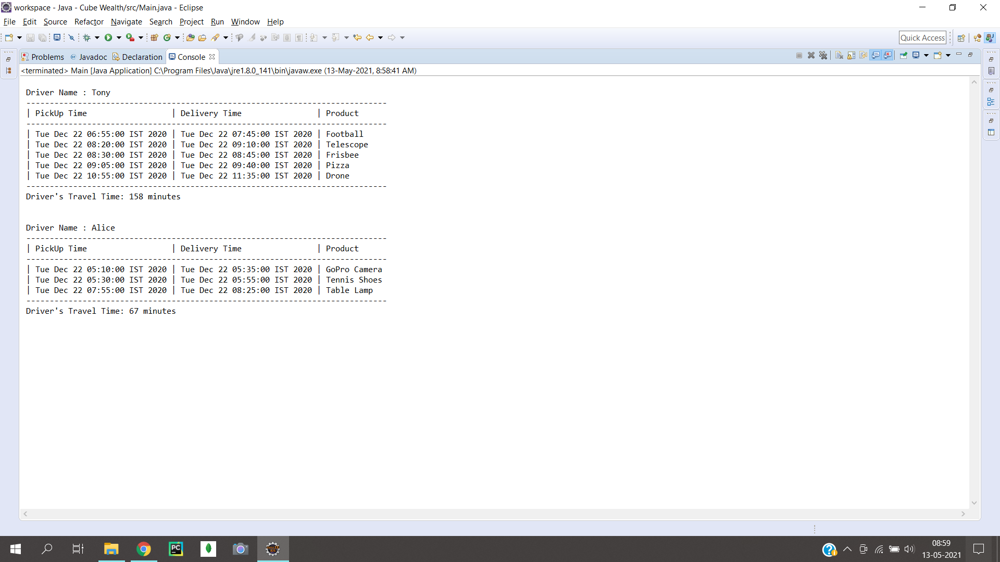

<h1 align="center">Welcome to Cube Wealth Travel Time Calculation System 👋</h1>



> The project, “Cube Wealth Travel Time Calculation System” is a Java project which calculates on road time of Driver by considering, overlaping conditions of time slots and category of the product.

### 🏠 [Homepage](https://github.com/HoneyPatre)

## Prerequisites

- java packages

## Install

```sh
Eclipse
```

## Usage

```sh
run Main.java
or
javac DeliveryDriver.java
javac Main.java
java Main
```
Side Note: csv file path has to be changed according to respective system.

## Author

👤 **Honey Patre**

* Github: [@HoneyPatre](https://github.com/HoneyPatre)
* LinkedIn: [@honey-patre](https://linkedin.com/in/honey-patre-b87591178)
* Youtube: [@honey-patre](https://www.youtube.com/channel/UCVFMjbTF1qmD3YrABDjc40Q)
* Email    :  honeypatre019@gmail.com
